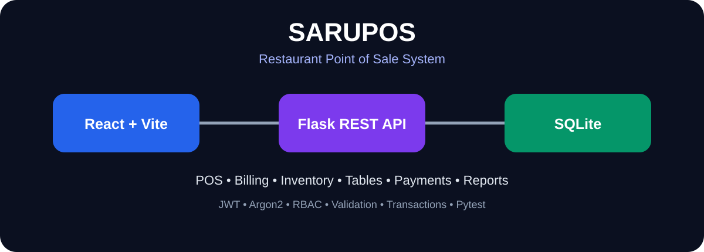
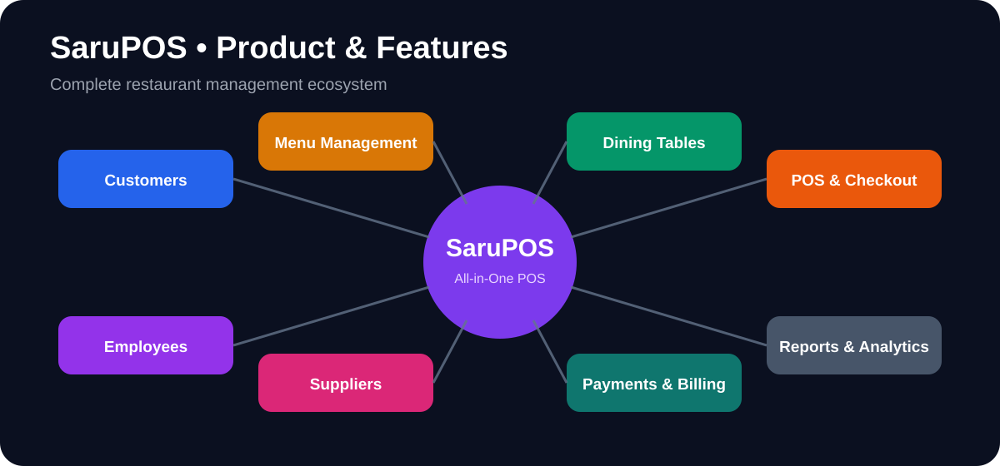
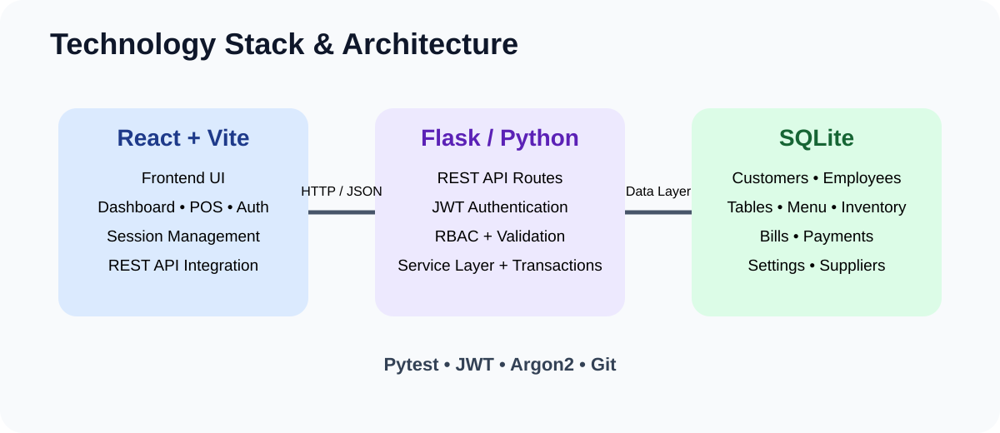
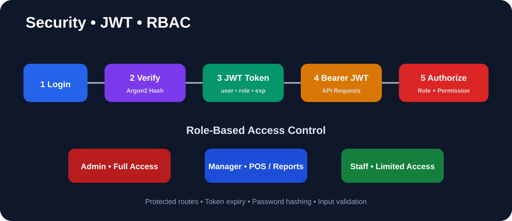
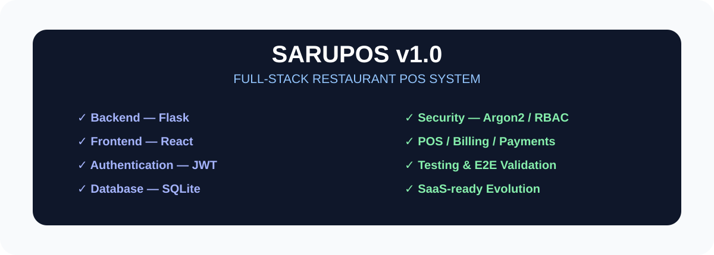
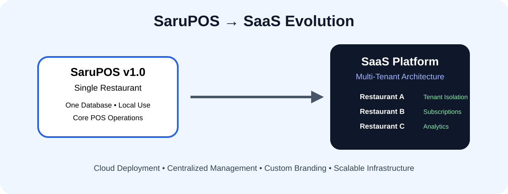
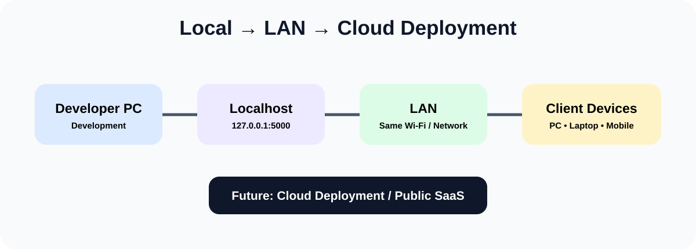

# 🍽️ SaruPOS — Restaurant Point of Sale System



> **A full-stack Restaurant POS built around real restaurant operations — from customer and table assignment to POS, atomic checkout, payment, receipt and table release.**

[](06_Frontend) [](05_Backend) [](04_Database) [](docs/SaruPOS_Technical_Master/03_SECURITY_JWT_RBAC.md) [](docs/SaruPOS_Technical_Master/05_TESTING_VALIDATION_AND_CAVEATS.md)

## 🚀 Live Demo

### 🌐 [Open SaruPOS Live Demo](https://sarupos-frontend.onrender.com)

**Frontend:** [sarupos-frontend.onrender.com](https://sarupos-frontend.onrender.com)  
**Backend API:** [sarupos-backend.onrender.com](https://sarupos-backend.onrender.com)

> **Note:** The public demo runs on Render Free. The service may sleep after inactivity, so the first request can take a little longer. The current deployment uses SQLite for demonstration/portfolio purposes; production persistence would use a managed database such as PostgreSQL.

---

## 🚀 Project at a Glance

**SaruPOS v1.0** is a full-stack Restaurant Point of Sale system designed to centralize daily restaurant operations in one application.

It covers:

- Authentication and role-based access
- Customers and employees
- Restaurant tables and dining sessions
- Categories and menu items
- POS / cart / checkout
- Billing and invoice flow
- Payments and receipt flow
- Inventory and suppliers
- Restaurant settings
- Reports / operational history
- POS draft persistence during navigation

### Core business workflow

```text
Customer
   ↓
Available Table
   ↓
Dining Session
   ↓
POS / Cart
   ↓
Server-side Checkout Validation
   ↓
Bill + Bill Items + Payment
   ↓
Receipt
   ↓
Dining Session Closed
   ↓
Table → Available
```

---

## 🧩 01 — Product & Feature Ecosystem



SaruPOS brings authentication, customers, tables, dining sessions, menu management, POS, billing, payments, inventory, suppliers, employees and reports into one restaurant-management ecosystem.

**Key implementation features:** server-generated customer IDs, duplicate-phone protection, occupied-table filtering, active customer/table dining sessions, server-authoritative pricing and tax, atomic checkout, and unfinished POS draft persistence.

[Read the technical document →](docs/SaruPOS_Technical_Master/01_PRODUCT_AND_FEATURES.md)

---

## 🏗️ 02 — Technology Stack & Architecture



```text
React + Vite
     ↓ HTTP / JSON
Flask REST API
     ↓
Authentication + RBAC + Validation
     ↓
Service Layer / Business Logic
     ↓
SQLite
```

| Layer | Technology |
|---|---|
| Frontend | React + Vite |
| Backend | Python + Flask |
| API | REST-style HTTP/JSON |
| Database | SQLite |
| Authentication | JWT |
| Password hashing | Argon2 |
| Authorization | RBAC |
| Testing | Pytest |
| POS persistence | Browser `sessionStorage` |
| Version control | Git / GitHub |

[Read the architecture document →](docs/SaruPOS_Technical_Master/02_TECH_STACK_AND_ARCHITECTURE.md)

---

## 🔐 03 — Security, JWT & RBAC



Authentication follows:

**Login → Credential Verification → JWT → Bearer Token → JWT Validation → Role Authorization → Service Layer**

The application uses **Argon2** for password hashing and **JWT** for protected API access. Admin, Manager and Staff permissions are enforced by backend authorization rules.

Checkout integrity is protected by backend validation of customer, employee, table/session, menu availability, payment method, current menu prices and tax configuration. Related checkout writes are committed as one transaction.

[Read the security document →](docs/SaruPOS_Technical_Master/03_SECURITY_JWT_RBAC.md)

---

## 🔄 04 — Business & Data Flow


The business model connects:

**Customer + Employee + Table → Bill → Bill Items → Payment**

and inventory follows:

**Supplier → Inventory Item → Quantity / Cost / Reorder Level**

Important consistency rules include available-table validation, active dining-session linkage, unavailable-menu protection, server-side price/tax authority and automatic table release after successful checkout.

[Read the business/data-flow document →](docs/SaruPOS_Technical_Master/04_BUSINESS_FLOW_AND_DATA_FLOW.md)

---

## 🧪 05 — Testing & Validation


Validation used both **automated API/security/service testing** and **manual integrated E2E testing**.

Manual validation covered authentication, role restrictions, customer/table assignment, occupied-table behavior, duplicate customer protection, menu availability, POS ordering, checkout/payment, receipt flow, table release and POS draft persistence.

> **Current validation:** the deployed application has been manually verified through the complete core E2E POS workflow.

[Read the testing document →](docs/SaruPOS_Technical_Master/05_TESTING_VALIDATION_AND_CAVEATS.md)

---

## 🖥️ 06 — GitHub Project Presentation


This repository is organized as a real project workspace rather than only an application folder:

```text
01_Product_Blueprint/
02_System_Design/
03_ER_Diagrams/
04_Database/
05_Backend/
06_Frontend/
docs/
tests/
AUDIT_REPORT.md
FINAL_VALIDATION.md
RUN_LOCAL.md
RUN_TESTS.ps1
```

[Read the README presentation document →](docs/SaruPOS_Technical_Master/06_GITHUB_README_DRAFT.md)

---

## 📊 07 — LinkedIn / Portfolio Showcase



SaruPOS demonstrates practical experience across full-stack development, REST APIs, authentication, authorization, transaction integrity, frontend/backend integration, testing and software architecture.

[Read the showcase/post draft →](docs/SaruPOS_Technical_Master/07_LINKEDIN_PROJECT_AND_POST_DRAFT.md)

---

## ☁️ 08 — SaruPOS → SaaS POS Evolution



SaruPOS v1.0 is the foundation for a future **multi-tenant SaaS POS**.

```text
Single Restaurant
       ↓
Tenant-aware Architecture
       ↓
Multi-Tenant SaaS
       ↓
Branches + Subscriptions
       ↓
Centralized Management
       ↓
Cloud Deployment
```

The core future security rule is simple: **Tenant A must never read or modify Tenant B data.**

[Read the SaaS roadmap →](docs/SaruPOS_Technical_Master/08_SAAS_POS_EVOLUTION_ROADMAP.md)

---

## 🌐 09 — Local / LAN / Cloud Deployment



Current local development endpoints:

- Backend: `http://127.0.0.1:5000`
- Frontend: `http://localhost:5173`

### Public deployment

- **Frontend:** https://sarupos-frontend.onrender.com
- **Backend:** https://sarupos-backend.onrender.com
- **Platform:** Render
- **Frontend:** React/Vite Static Site
- **Backend:** Flask Web Service + Gunicorn

The project can be demonstrated locally, extended to a same-network LAN setup, and deployed publicly through a secured cloud environment. The current public deployment is intended for portfolio/demo use.

[Read the deployment document →](docs/SaruPOS_Technical_Master/09_LOCAL_LAN_DEMO_DEPLOYMENT.md)

---

## 🗺️ 10 — Complete Technical Documentation Map


The technical master set connects the **product → architecture → security → business flow → testing → portfolio → SaaS → deployment** journey in one place.

[Open the master index →](docs/SaruPOS_Technical_Master/10_MASTER_INDEX.md)

---

## 📚 Technical Documentation

| # | Document | Focus |
|---|---|---|
| 01 | [Product & Features](docs/SaruPOS_Technical_Master/01_PRODUCT_AND_FEATURES.md) | Product scope and feature ecosystem |
| 02 | [Tech Stack & Architecture](docs/SaruPOS_Technical_Master/02_TECH_STACK_AND_ARCHITECTURE.md) | Layers, technologies and data domains |
| 03 | [Security, JWT & RBAC](docs/SaruPOS_Technical_Master/03_SECURITY_JWT_RBAC.md) | Authentication, authorization and checkout integrity |
| 04 | [Business & Data Flow](docs/SaruPOS_Technical_Master/04_BUSINESS_FLOW_AND_DATA_FLOW.md) | Operational workflow and consistency rules |
| 05 | [Testing & Validation](docs/SaruPOS_Technical_Master/05_TESTING_VALIDATION_AND_CAVEATS.md) | Automated/manual validation and caveats |
| 06 | [GitHub README](docs/SaruPOS_Technical_Master/06_GITHUB_README_DRAFT.md) | Project presentation |
| 07 | [LinkedIn / Portfolio](docs/SaruPOS_Technical_Master/07_LINKEDIN_PROJECT_AND_POST_DRAFT.md) | Professional showcase |
| 08 | [SaaS Evolution](docs/SaruPOS_Technical_Master/08_SAAS_POS_EVOLUTION_ROADMAP.md) | Multi-tenant future roadmap |
| 09 | [Local / LAN Deployment](docs/SaruPOS_Technical_Master/09_LOCAL_LAN_DEMO_DEPLOYMENT.md) | Demo and deployment path |
| 10 | [Master Index](docs/SaruPOS_Technical_Master/10_MASTER_INDEX.md) | Complete documentation map |

Additional repository documentation includes the product blueprint, system design, ER diagrams, database documentation, API documentation, backend audit material and local run/test guides.

---

## ⚙️ Run Locally

### Backend

```powershell
cd 05_Backend
python -m venv venv
.\venv\Scripts\Activate.ps1
pip install -r requirements.txt
$env:SARU_POS_JWT_SECRET = python -c "import secrets; print(secrets.token_urlsafe(32))"
python app.py
```

Backend: `http://127.0.0.1:5000`

### Frontend

Open a second terminal:

```powershell
cd 06_Frontend
npm install
npm run dev
```

Frontend: `http://localhost:5173`

For the full local procedure, see [RUN_LOCAL.md](RUN_LOCAL.md).

---

## 🎯 Project Status

### **SaruPOS v1.0 — Core POS Implementation Complete ✅**

**Built → Audited → Validated → Documented → Deployed**

The current public deployment demonstrates the complete core POS workflow from authentication and table assignment through checkout, payment and table release.

Next evolution:

**SaruPOS → SaaS POS**

---

## 👨‍💻 Author

**Saravana Kumar M**  
Electrical & Electronics Engineering Student • Tech Builder

- GitHub: [@romansaravana619-lang](https://github.com/romansaravana619-lang)
- LinkedIn: [Saravana Kumar](https://www.linkedin.com/in/saravana-kumar-m-34a7b1421/)

---

## ⭐ What This Project Demonstrates

**Full-Stack Development • React • Python • Flask • REST APIs • SQLite • JWT • Argon2 • RBAC • Backend Validation • Transactions • Testing • Software Architecture • Documentation • Cloud Deployment • SaaS Planning**

> **SaruPOS is more than a POS project — it is a foundation for building a larger software product.**
