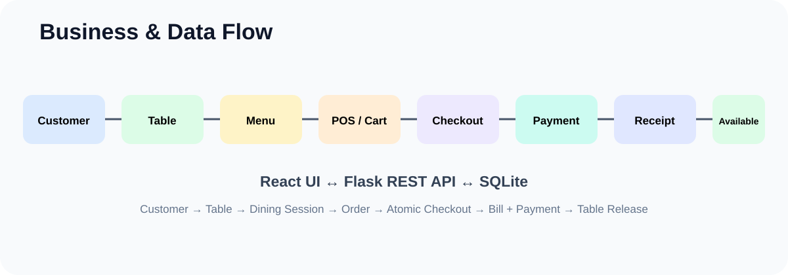

# SaruPOS — Business & Data Flow

## End-to-end workflow
Customer → Table → Dining Session → POS → Checkout → Bill → Payment → Receipt → Table Available.

## Customer/table flow
Selecting an available table establishes the operational customer/table relationship and active dining session, changing the table to Occupied.

## POS flow
The frontend maintains customer, table/session, cart and payment context. An unfinished order can survive module navigation using sessionStorage.

## Checkout flow
The backend validates business state, reads authoritative menu prices and tax configuration, then performs related writes atomically.

## Billing relationship
Customer + Employee + Table → Bill → Bill Items → Payment.

## Inventory
Supplier → Inventory Item → quantity / unit / cost / reorder level.

## Key consistency rules
- Occupied tables are not treated as freely available.
- Active dining session links customer and table.
- Unavailable menu items cannot be checked out.
- Backend price/tax is authoritative.
- Successful checkout releases the table.