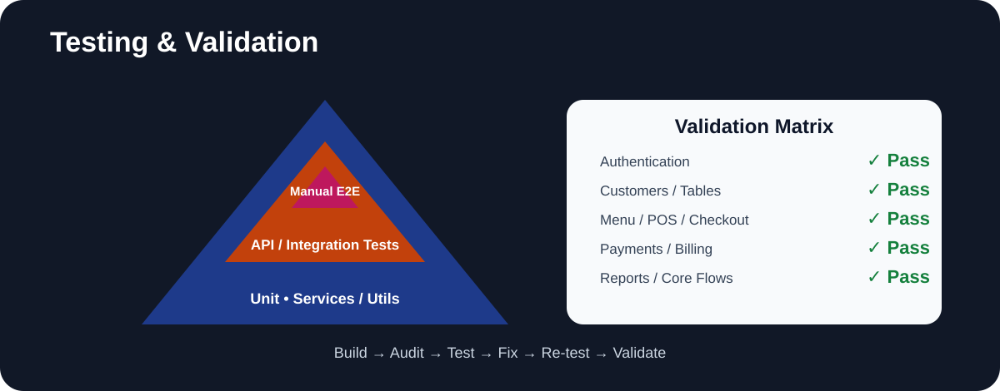

# SaruPOS — Testing & Validation

## Validation model
The project uses two important validation dimensions:
1. Automated API/security/service testing
2. Manual integrated end-to-end validation

## Manual validation completed
Admin login; Manager access; Staff role/restriction behavior; customer creation; table assignment; Occupied/Available state; duplicate customer phone prevention; occupied-table filtering; unavailable menu-item protection; fresh order E2E; payment/checkout; receipt; table release; POS persistence; browser title `SaruPOS`.

## Automated testing
Earlier audit work reached 23 passed after correcting test-fixture/import assumptions.

## Caveat
A later production-clean test run still showed a subset of failures/errors related to test fixtures/import assumptions. Therefore public material should not claim “all automated tests pass” unless the current Git commit is freshly tested and confirms it.

## Recommended public wording
“Validated through API/security testing and manual end-to-end testing across customer/table assignment, POS ordering, checkout, payment, receipt generation and table release.”