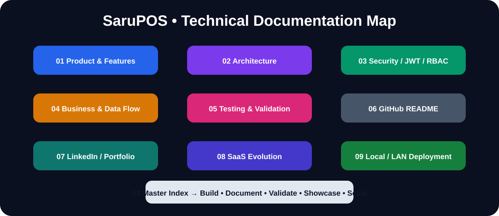

# SaruPOS — Complete Documentation Map

## Documentation journey
1. Product & Features
2. Technology Stack & Architecture
3. Security / JWT / RBAC
4. Business & Data Flow
5. Testing & Validation
6. GitHub README
7. LinkedIn / Portfolio
8. SaaS POS Evolution
9. Local / LAN / Cloud Deployment

## Project journey
**Built → Documented → Showcased → SaaS Evolution → Deployment**

## Review purpose
This master index connects the technical implementation, portfolio presentation and future SaaS roadmap into one reference set.